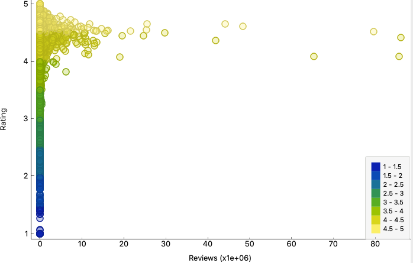
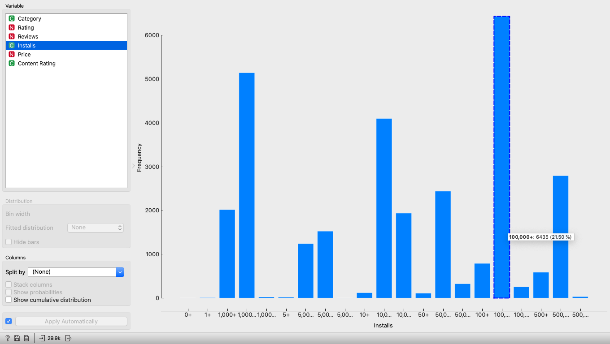

# Projeto Orange / Regras de Associação para Foodmart

## Imagem do Projeto

## Arquivo do Projeto
[projeto](orange/lab1-ex1.ows)

# Projeto Orange / Análise de Dados do Google PlayStore

## Imagem do Projeto

## Arquivo do Projeto
[projeto](orange/lab1-ex2.ows)

## Gráfico(s) de Análise
### Relação entre quantidade de avaliação e nota de avaliação dos apps.

### Distribuição de apps por categoria.

### Distribuição de apps pagos por quantidade de *Donwloads*.

### Distribuição de apps gratuitos por quantidade de *Donwloads*.

# Projeto de Composição de Componentes para Recomendação

> Imagem (`PNG`) do diagrama de componentes (veja exemplos abaixo).

# Projeto de Composição de Componentes para Pedido

## Diagrama de Componentes

> Imagem (`PNG`) do diagrama de componentes do pedido de um produto (veja exemplos abaixo).

## Diagrama de Interfaces

> Imagem (`PNG`) do detalhamento de interfaces referentes aos componentes.