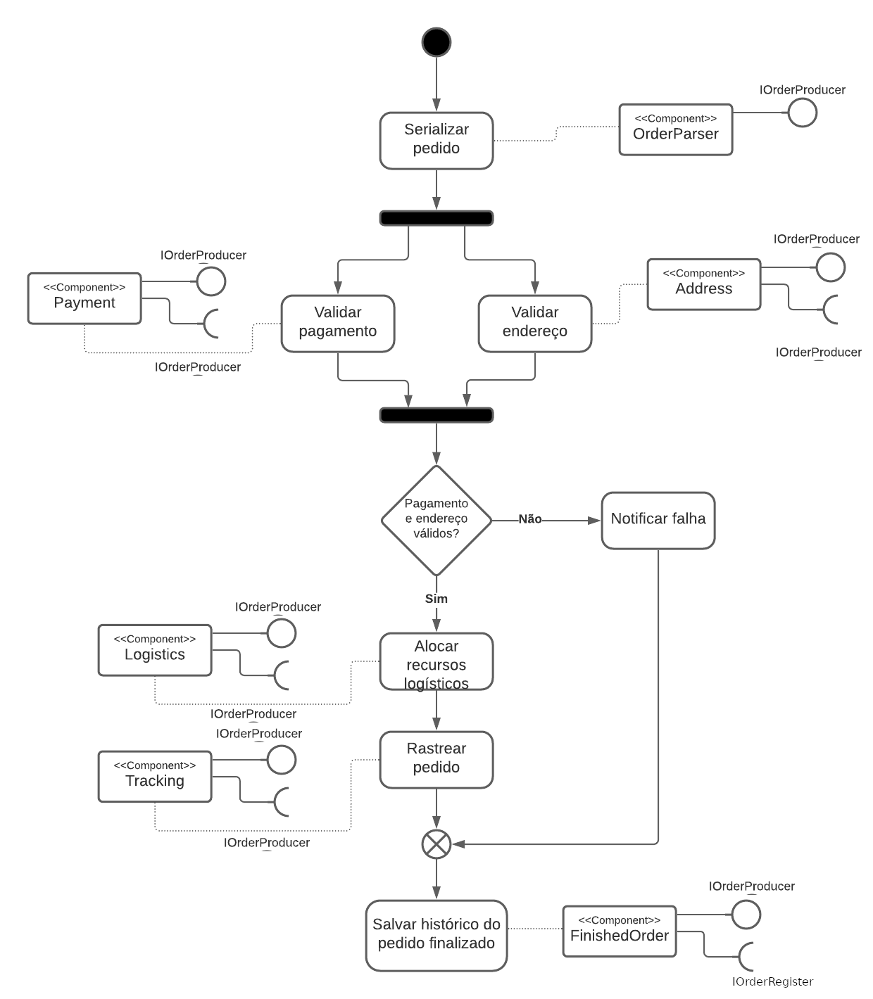
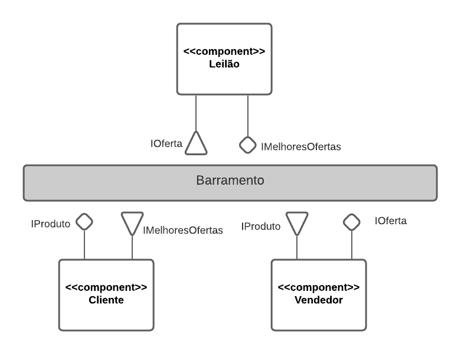
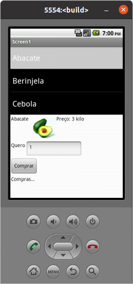
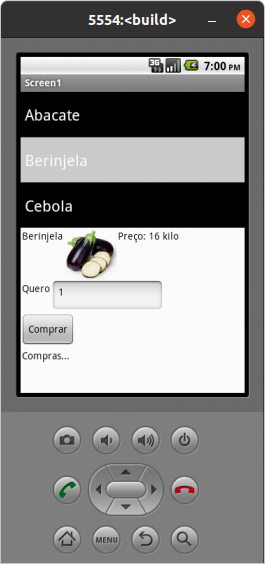
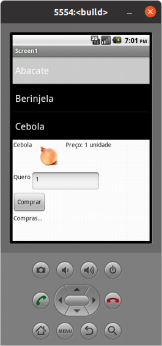

# Lab03 - Model-View-Controller

## Tarefa 1

## Tarefa 2

## Tarefa 3
### tela 1 - nenhum produto selecionado

### tela 2 - primeiro produto selecionado

### tela 3 - segundo produto selecionado

### tela 4 - compra de um dos produtos efetiva

### tela 5 - diagrama de blocos do aplicativo

[App](app/lab3.aia)