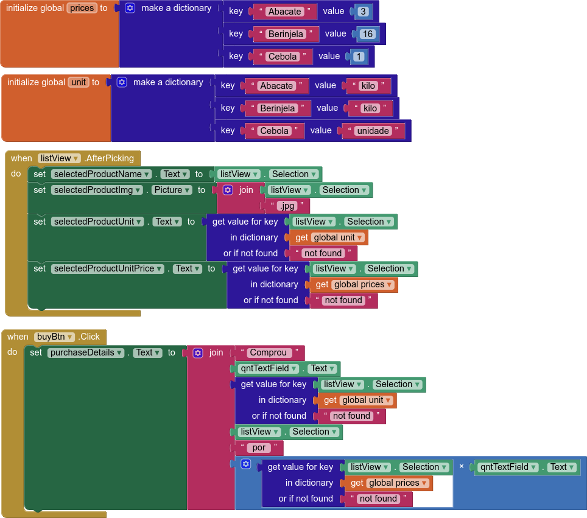

# Lab03 - Model-View-Controller

## Tarefa 1

## Tarefa 2

## Tarefa 3
### Tela 1 - primeiro produto selecionado

### Tela 2 - segundo produto selecionado

### Tela 3 - terceiro produto selecionado

### Tela 4 - compra de um dos produtos efetiva

### Diagrama de blocos do aplicativo

[App](app/lab3.aia)