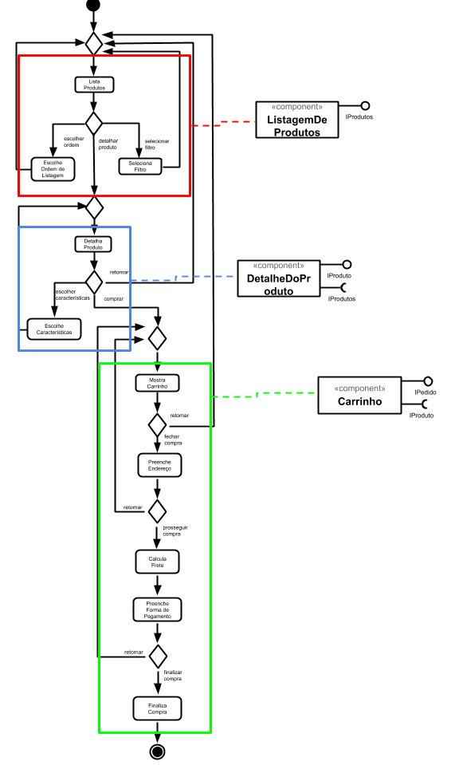
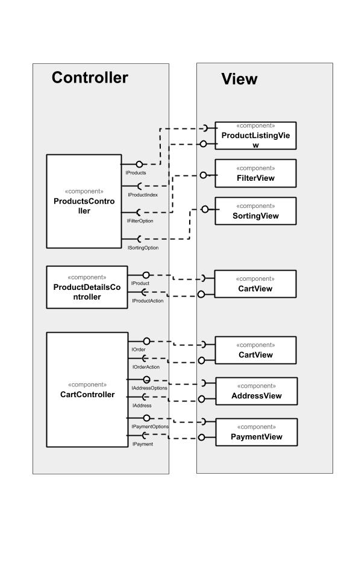
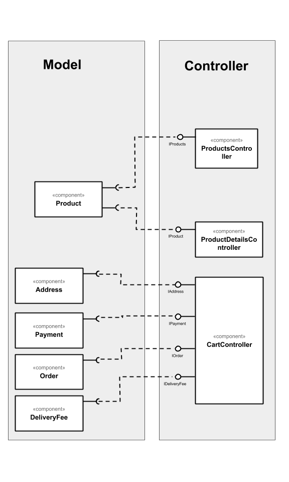

# Modelo para Apresentação do Lab04 - Serviços

## Tarefa 1

## Tarefa 2

## Tarefa 3

## Tarefa 4

### MusicBrainz

* **Título do serviço**: `MusicBrainz`
* **Breve descrição**:
It is aimed at developers of media players, CD rippers, taggers, and other applications requiring music metadata.

* **URL completa da requisição**: `https://musicbrainz.org/ws/2/artist?query=angra&fmt=json`
* **Cabeçalho HTTP da chamada**:
~~~http
GET /ws/2/artist?query=angra&fmt=json HTTP/1.1
User-Agent: PostmanRuntime/7.21.0
Accept: */*
Cache-Control: no-cache
Postman-Token: 64db8422-5739-4e03-88b3-70eabd60c32f
Host: musicbrainz.org
Accept-Encoding: gzip, deflate
Connection: keep-alive
~~~
* **Cabeçalho HTTP da resposta**:
~~~http
HTTP/1.1 200 OK
Date: Sat, 29 Aug 2020 00:57:23 GMT
Content-Type: application/json
Transfer-Encoding: chunked
Connection: keep-alive
Keep-Alive: timeout=15
X-RateLimit-Limit: 1200
X-RateLimit-Remaining: 1001
X-RateLimit-Reset: 1598662644
Last-Modified: Sat, 29 Aug 2020 00:56:47 GMT
ETag: "NTUzNWE0MDAwMDAwMDAwMFNvbHI="
Vary: Accept-Encoding
Content-Encoding: gzip
X-Cache-Status: MISS
Access-Control-Allow-Origin: *
~~~
* **Conteúdo da resposta**:
~~~json
{
    "created": "2020-08-29T00:57:23.283Z",
    "count": 51,
    "offset": 0,
    "artists": [
        {
            "id": "b0fe8ef0-d59b-4d41-afee-2d21b59112ab",
            "type": "Group",
            "type-id": "e431f5f6-b5d2-343d-8b36-72607fffb74b",
            "score": 100,
            "name": "Angra",
            "sort-name": "Angra",
            "country": "BR",
            "area": {
                "id": "f45b47f8-5796-386e-b172-6c31b009a5d8",
                "type": "Country",
                "type-id": "06dd0ae4-8c74-30bb-b43d-95dcedf961de",
                "name": "Brazil",
                "sort-name": "Brazil",
                "life-span": {
                    "ended": null
                }
            },
            "begin-area": {
                "id": "33e0f86c-d709-448d-a484-d55778913af1",
                "type": "City",
                "type-id": "6fd8f29a-3d0a-32fc-980d-ea697b69da78",
                "name": "São Paulo",
                "sort-name": "São Paulo",
                "life-span": {
                    "ended": null
                }
            },
            "life-span": {
                "begin": "1991",
                "ended": null
            },
            "tags": [
                {
                    "count": 1,
                    "name": "progressive metal"
                },
                {
                    "count": 4,
                    "name": "power metal"
                },
                {
                    "count": 1,
                    "name": "speed metal"
                }
            ]
        },
        {
            "id": "610789a0-f7fa-4dfd-8be0-211759454fee",
            "type": "Group",
            "type-id": "e431f5f6-b5d2-343d-8b36-72607fffb74b",
            "score": 77,
            "name": "Angra Mainyu",
            "sort-name": "Angra Mainyu",
            "country": "DE",
            "area": {
                "id": "85752fda-13c4-31a3-bee5-0e5cb1f51dad",
                "type": "Country",
                "type-id": "06dd0ae4-8c74-30bb-b43d-95dcedf961de",
                "name": "Germany",
                "sort-name": "Germany",
                "life-span": {
                    "ended": null
                }
            },
            "life-span": {
                "begin": "2002",
                "ended": null
            }
        },
        {
            "id": "706af8f2-5eaa-46b4-aaa2-d2e30ea0e31f",
            "type": "Person",
            "type-id": "b6e035f4-3ce9-331c-97df-83397230b0df",
            "score": 41,
            "name": "Tangram",
            "sort-name": "Tangram",
            "gender": "male",
            "area": {
                "id": "f1ac379f-8cd3-45c3-8da0-80c429b36c5e",
                "type": "City",
                "type-id": "6fd8f29a-3d0a-32fc-980d-ea697b69da78",
                "name": "Budapest",
                "sort-name": "Budapest",
                "life-span": {
                    "ended": null
                }
            },
            "disambiguation": "Péter Fabók",
            "life-span": {
                "ended": null
            }
        },
        {
            "id": "56b21938-7d68-4fa9-a1a4-a1615dee8feb",
            "type": "Group",
            "type-id": "e431f5f6-b5d2-343d-8b36-72607fffb74b",
            "score": 40,
            "name": "Klangraum",
            "sort-name": "Klangraum",
            "country": "DE",
            "area": {
                "id": "85752fda-13c4-31a3-bee5-0e5cb1f51dad",
                "type": "Country",
                "type-id": "06dd0ae4-8c74-30bb-b43d-95dcedf961de",
                "name": "Germany",
                "sort-name": "Germany",
                "life-span": {
                    "ended": null
                }
            },
            "disambiguation": "Production music project",
            "life-span": {
                "begin": "1985",
                "ended": null
            }
        },
        {
            "id": "29d4a0bf-d048-46b1-8b18-bd6e375e513a",
            "type": "Person",
            "type-id": "b6e035f4-3ce9-331c-97df-83397230b0df",
            "score": 39,
            "name": "John Langran",
            "sort-name": "Langran, John",
            "gender": "male",
            "life-span": {
                "ended": null
            }
        },
        {
            "id": "5b9873ed-441e-45bd-8f5d-424168b67631",
            "type": "Group",
            "type-id": "e431f5f6-b5d2-343d-8b36-72607fffb74b",
            "score": 38,
            "name": "Bhangra Knights",
            "sort-name": "Bhangra Knights",
            "country": "GB",
            "area": {
                "id": "8a754a16-0027-3a29-b6d7-2b40ea0481ed",
                "type": "Country",
                "type-id": "06dd0ae4-8c74-30bb-b43d-95dcedf961de",
                "name": "United Kingdom",
                "sort-name": "United Kingdom",
                "life-span": {
                    "ended": null
                }
            },
            "life-span": {
                "ended": null
            }
        },
        {
            "id": "ce5289bf-a621-4111-84fd-0acc962fe6db",
            "type": "Group",
            "type-id": "e431f5f6-b5d2-343d-8b36-72607fffb74b",
            "score": 37,
            "name": "Vangrail",
            "sort-name": "Vangrail",
            "life-span": {
                "ended": null
            }
        },
        {
            "id": "280ca12e-ed3c-4a8f-b8a7-289a34668d87",
            "type": "Group",
            "type-id": "e431f5f6-b5d2-343d-8b36-72607fffb74b",
            "score": 37,
            "name": "dejalosangrar",
            "sort-name": "dejalosangrar",
            "country": "CL",
            "area": {
                "id": "82d5f4d6-aed4-3ff5-81d1-5363ac6e97a7",
                "type": "Country",
                "type-id": "06dd0ae4-8c74-30bb-b43d-95dcedf961de",
                "name": "Chile",
                "sort-name": "Chile",
                "life-span": {
                    "ended": null
                }
            },
            "begin-area": {
                "id": "77ec97c2-5377-4ac7-b156-620470e71940",
                "type": "City",
                "type-id": "6fd8f29a-3d0a-32fc-980d-ea697b69da78",
                "name": "Santiago",
                "sort-name": "Santiago",
                "life-span": {
                    "ended": null
                }
            },
            "life-span": {
                "ended": null
            },
            "tags": [
                {
                    "count": 1,
                    "name": "drone"
                },
                {
                    "count": 1,
                    "name": "punk"
                },
                {
                    "count": 1,
                    "name": "rock"
                },
                {
                    "count": 1,
                    "name": "stoner"
                },
                {
                    "count": 1,
                    "name": "sludge"
                },
                {
                    "count": 1,
                    "name": "doom"
                }
            ]
        },
        {
            "id": "0bb0467a-2936-4892-aaaa-bc830269affe",
            "type": "Group",
            "type-id": "e431f5f6-b5d2-343d-8b36-72607fffb74b",
            "score": 37,
            "name": "Sangraal",
            "sort-name": "Sangraal",
            "area": {
                "id": "82f3a697-ba65-404d-a1ed-360147af7d10",
                "type": "City",
                "type-id": "6fd8f29a-3d0a-32fc-980d-ea697b69da78",
                "name": "San Diego",
                "sort-name": "San Diego",
                "life-span": {
                    "ended": null
                }
            },
            "life-span": {
                "ended": null
            }
        },
        {
            "id": "8f91cde1-f59d-49d4-942a-bd9e6efe35e8",
            "type": "Group",
            "type-id": "e431f5f6-b5d2-343d-8b36-72607fffb74b",
            "score": 37,
            "name": "bangrantisio",
            "sort-name": "bangrantisio",
            "life-span": {
                "ended": null
            }
        },
        {
            "id": "3da02cd0-0b6e-40de-bc9b-a940405e77da",
            "type": "Group",
            "type-id": "e431f5f6-b5d2-343d-8b36-72607fffb74b",
            "score": 37,
            "name": "Tangram",
            "sort-name": "Tangram",
            "country": "DE",
            "area": {
                "id": "85752fda-13c4-31a3-bee5-0e5cb1f51dad",
                "type": "Country",
                "type-id": "06dd0ae4-8c74-30bb-b43d-95dcedf961de",
                "name": "Germany",
                "sort-name": "Germany",
                "life-span": {
                    "ended": null
                }
            },
            "disambiguation": "German folk, world music group",
            "life-span": {
                "ended": null
            }
        },
        {
            "id": "1c02bf24-81b8-4f9e-9d23-0a6add315f7c",
            "type": "Person",
            "type-id": "b6e035f4-3ce9-331c-97df-83397230b0df",
            "score": 37,
            "name": "Tim Angrave",
            "sort-name": "Angrave, Tim",
            "gender": "male",
            "life-span": {
                "ended": null
            }
        },
        {
            "id": "98c63df9-37fe-43fa-a838-03fa7c2b94a4",
            "score": 37,
            "name": "Tangram",
            "sort-name": "Tangram",
            "disambiguation": "ambient",
            "life-span": {
                "ended": null
            }
        },
        {
            "id": "18485515-e374-4da3-94d5-e4dc11128d1e",
            "score": 37,
            "name": "Tangram",
            "sort-name": "Tangram",
            "disambiguation": "hard rock",
            "life-span": {
                "ended": null
            }
        },
        {
            "id": "5172ffff-d82c-43b3-9fab-65715f132ab8",
            "type": "Group",
            "type-id": "e431f5f6-b5d2-343d-8b36-72607fffb74b",
            "score": 37,
            "name": "Bhangralution",
            "sort-name": "Bhangralution",
            "life-span": {
                "ended": null
            }
        },
        {
            "id": "950306bc-2d81-4974-b476-34e1821ee8df",
            "score": 36,
            "name": "TANGRAM",
            "sort-name": "TANGRAM",
            "disambiguation": "Chinese (?) artist",
            "life-span": {
                "ended": null
            }
        },
        {
            "id": "2ff32294-a300-4d92-8c41-5b369d03eb02",
            "score": 36,
            "name": "Klangrausch",
            "sort-name": "Klangrausch",
            "life-span": {
                "ended": null
            }
        },
        {
            "id": "f3075f50-b7aa-4766-bae5-10383cecf16f",
            "score": 36,
            "name": "Tangram",
            "sort-name": "Tangram",
            "disambiguation": "Italian rock?",
            "life-span": {
                "ended": null
            }
        },
        {
            "id": "9b8c75dc-5ff6-439a-b6e2-e9ee2bd8bf4b",
            "score": 36,
            "name": "Angrave",
            "sort-name": "Angrave",
            "disambiguation": "often with Carl Vega.",
            "life-span": {
                "ended": null
            }
        },
        {
            "id": "d6a9ab01-0f61-4be5-80e7-cd48384c24a3",
            "type": "Person",
            "type-id": "b6e035f4-3ce9-331c-97df-83397230b0df",
            "score": 36,
            "name": "Giangrano",
            "sort-name": "Giangrano",
            "life-span": {
                "ended": null
            }
        },
        {
            "id": "e3b4db44-a914-4ef4-ae80-681323c8102a",
            "type": "Person",
            "type-id": "b6e035f4-3ce9-331c-97df-83397230b0df",
            "score": 36,
            "name": "Bp Pontjopangrawit",
            "sort-name": "Pontjopangrawit, Bp",
            "gender": "male",
            "country": "ID",
            "area": {
                "id": "d3a68bd0-7419-3f99-a5bd-204d6e057089",
                "type": "Country",
                "type-id": "06dd0ae4-8c74-30bb-b43d-95dcedf961de",
                "name": "Indonesia",
                "sort-name": "Indonesia",
                "life-span": {
                    "ended": null
                }
            },
            "begin-area": {
                "id": "17278e11-3ef6-4c30-a880-00a33aea6ce3",
                "type": "City",
                "type-id": "6fd8f29a-3d0a-32fc-980d-ea697b69da78",
                "name": "Surakarta",
                "sort-name": "Surakarta",
                "life-span": {
                    "ended": null
                }
            },
            "disambiguation": "indonesian rebab player and gamelan maker",
            "life-span": {
                "begin": "1893",
                "end": "1965-09-30",
                "ended": true
            }
        },
        {
            "id": "613419c9-e655-4b20-b088-68fd54f9f62c",
            "type": "Person",
            "type-id": "b6e035f4-3ce9-331c-97df-83397230b0df",
            "score": 36,
            "name": "Alessandro Giangrande",
            "sort-name": "Giangrande, Alessandro",
            "gender": "male",
            "country": "IT",
            "area": {
                "id": "c6500277-9a3d-349b-bf30-41afdbf42add",
                "type": "Country",
                "type-id": "06dd0ae4-8c74-30bb-b43d-95dcedf961de",
                "name": "Italy",
                "sort-name": "Italy",
                "life-span": {
                    "ended": null
                }
            },
            "begin-area": {
                "id": "5c727225-434c-4117-99ae-029c16b346be",
                "type": "Municipality",
                "type-id": "17246454-5ac4-36a1-b81a-4753eb2dab20",
                "name": "Monopoli",
                "sort-name": "Monopoli",
                "life-span": {
                    "ended": null
                }
            },
            "disambiguation": "tenor",
            "isnis": [
                "0000000385424541"
            ],
            "life-span": {
                "begin": "1978",
                "ended": null
            }
        },
        {
            "id": "98c5e254-a7ee-446d-9baf-5f43a9b71322",
            "score": 36,
            "name": "Fourniersches Gangraen",
            "sort-name": "Fourniersches Gangraen",
            "life-span": {
                "ended": null
            }
        },
        {
            "id": "afc6f269-843d-42ef-9664-fb44bfac60e9",
            "score": 36,
            "name": "Sangrado Anal",
            "sort-name": "Sangrado Anal",
            "area": {
                "id": "89048724-9d29-48b6-acb8-860fb700bd1b",
                "type": "City",
                "type-id": "6fd8f29a-3d0a-32fc-980d-ea697b69da78",
                "name": "Toluca",
                "sort-name": "Toluca",
                "life-span": {
                    "ended": null
                }
            },
            "life-span": {
                "ended": null
            }
        },
        {
            "id": "a5137fda-d0dd-4235-9d0e-a589dc12529a",
            "type": "Group",
            "type-id": "e431f5f6-b5d2-343d-8b36-72607fffb74b",
            "score": 36,
            "name": "Bhangra Brothers",
            "sort-name": "Bhangra Brothers",
            "life-span": {
                "ended": null
            }
        }
    ]
}
~~~

## Lyrics.ovh

* **Título do serviço**: `lyrics.ovh`
* **Breve descrição**:
Simple API to retrieve the lyrics of a song.
* **URL completa da requisição**: `https://api.lyrics.ovh/v1/angra/time`
* **Cabeçalho HTTP da chamada**:
~~~http
GET /v1/angra/time HTTP/1.1
Host: api.lyrics.ovh
User-Agent: PostmanRuntime/7.21.0
Accept: */*
Cache-Control: no-cache
Postman-Token: 5546ad98-75e5-4da7-90d3-96dc5cdb6784
Accept-Encoding: gzip, deflate
Connection: keep-alive
~~~
* **Cabeçalho HTTP da resposta**:
~~~http
Date: Sat, 29 Aug 2020 00:41:48 GMT
Server: Apache/2.4.25 (Debian)
X-Powered-By: Express
Access-Control-Allow-Origin: *
Content-Type: application/json; charset=utf-8
Content-Length: 1801
ETag: W/"709-/wwmfUVbQEIyiVpY5+i/unCOpLA"
Keep-Alive: timeout=5, max=100
Connection: Keep-Alive
~~~
* **Conteúdo da resposta**:
~~~json
{
    "lyrics": "[Matos, Bittencourt]\r\nThis time I wanna know\r\nwhat life means...\r\n...to live it again\r\nlooking forward, feel the\n\nlight into my eyes...\n\nAnd now I know, my instincts\n\nwasn't wrong,\n\nand many things can be made\n\nI don't believe now,\n\n'Cause I'm dreaming alone\n\n\n\nOh, it's hard to find the love\n\nthat everyone's got,\n\nbut can't see (yeah)\n\nOh, beyond the flesh and blood\n\nthere's so much hidden behind\n\nthere's so much more we've gotta be\n\n\n\nSanity brings up the sadness\n\nand keeps your illusions locked\n\nin a little box\n\nFright comes, you find yourself lonely\n\nin a cage of conclusions\n\ncrownding your mind\n\n\n\nLove like they're bowing your head,\n\nevery answer - yes\n\nWhy do you trust me\n\nand scream out your fears,\n\nRunning over\n\nthe tears you've contained\n\nnow cover up your eyes,\n\n- Is that good for you?\n\n\n\nAnd I will be here when fire burns!...\n\n\n\nWelcome on board\n\nover here is the ship of your life\n\nSo rotten\n\nthat stinks like shit\n\nI'll be your sweet lullaby\n\nall night\n\nAnd if you fall\n\nand never wake up...\n\n\n\nAnd I'll be here when fire burns\n\n(inside your heart)\n\nClimb up the hills and mountains,\n\ndon't forget what you've learned!\n\n\n\nLife make us feel\n\nthe time we cannot hold\n\nTime make us live\n\na tale already told\n\nTime make us heal\n\nthe feeling inside\n\nthe feeling inside of our hearts\n\nand we steal away...\n\n\n\nI'll be here when fire burns\n\n(inside your heart)\n\nClimb up the hills and mountains,\n\ndon't forget what you've learned!\n\n\n\nLife make us feel\n\nthe time we cannot hold\n\nTime make us live\n\na tale already told\n\nLife make us heal [time make us heal]\n\nthe feeling inside\n\nthe feeling inside of our hearts\n\nand we steal away"
}
~~~