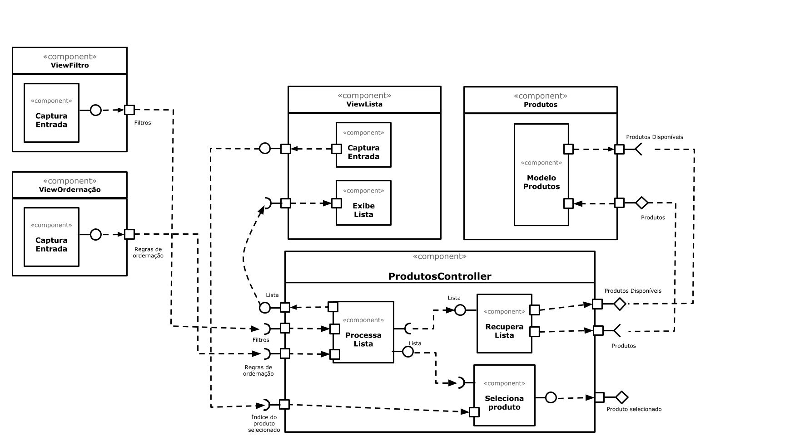

# Lab05 - Subcomponentes e Páginas Dinâmicas

## Tarefa 1
 

## Tarefa 2

  See the Pen <a href="https://codepen.io/lucas1295santos/pen/ExKbrYO">
  Dinossauro</a> by lucas1295santos (<a href="https://codepen.io/lucas1295santos">@lucas1295santos</a>)
  on <a href="https://codepen.io">CodePen</a>.

